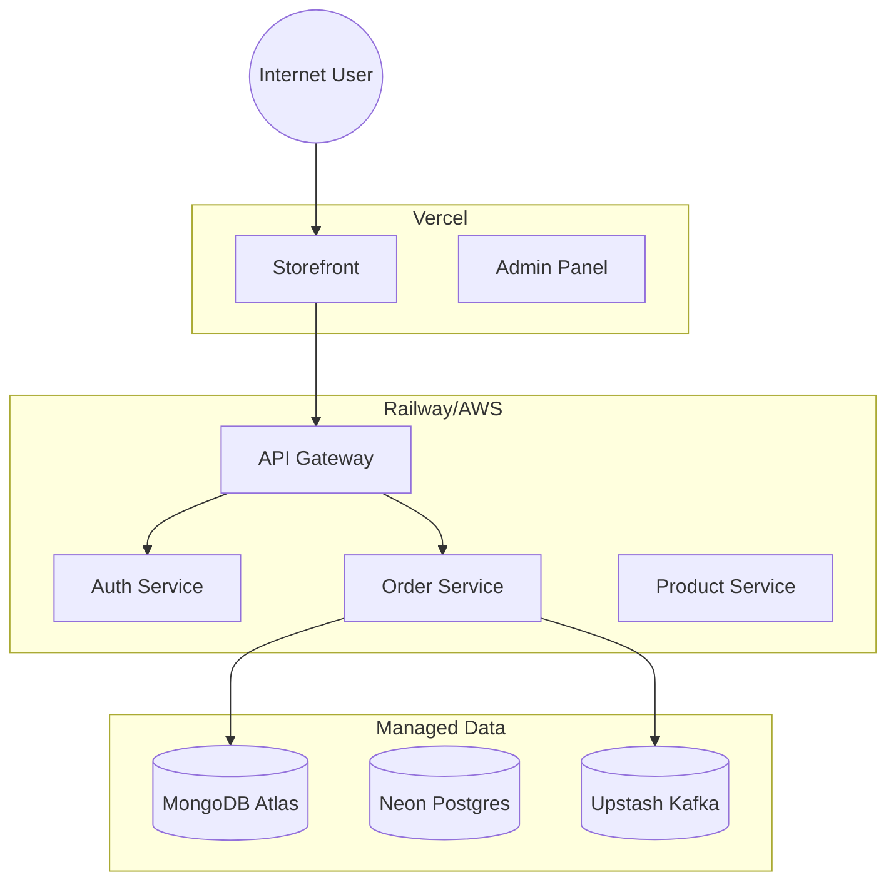

# 🚀 Deployment Guide: Making Your Project Live

To make your **Microservices E-commerce Platform** accessible on the internet (not just viewable as code), you need to **Deploy** it.

Since this is a complex application with multiple services (Next.js Frontend, Express Backends, Kafka, Databases), simple static hosting (like GitHub Pages) will **NOT** work.

## Recommended Cloud Providers

### 1. Frontend (Client & Admin) - [Vercel](https://vercel.com)
The best place to host Next.js applications.
- **Steps:**
  1. Push this repo to GitHub.
  2. Create a Vercel account.
  3. Import your repository.
  4. Configure the correct Root Directory for each app (`apps/client`, `apps/admin`).
  5. Add Environment Variables.

### 2. Backend Services - [Railway](https://railway.app) or [Render](https://render.com)
These platforms are excellent for hosting Docker containers and Node.js microservices.
- **Railway:** Can automatically detect your `Dockerfile` or `package.json` inside each service folder (`apps/product-service`, etc.).
- **Kafka:** You will use a managed Kafka provider like **Upstash** or **Confluent Cloud**.

### 3. Databases - Managed Services
Do not try to host databases yourself on the same server unless you are using a VPS (like DigitalOcean). Use managed services for reliability:
- **PostgreSQL:** [Neon.tech](https://neon.tech) or [Supabase](https://supabase.com)
- **MongoDB:** [MongoDB Atlas](https://www.mongodb.com/atlas)
- **Redis:** [Upstash](https://upstash.com)

## Deployment Architecture

## "Legacy" Xiaomi Project
Your Xiaomi project is a separate entity. If you wish to deploy it, follow similar steps but treat it as a separate application stack.
